# GitLab Branch 운영 전략

## Voice ID 기반 추천 서비스 PJT Branch 운영 전략

해당 프로젝트는 데이터 분석 프로젝트로  
1차적으로 개인 클라우드 백업을 목적으로 브랜치를 운영합니다.  

분석을 통해 인사이트를 도출하고 서비스 기획이 완료되면, Git flow 기반의 Branch 전략을 사용할 예정입니다.  

---

## [Branch 운영 전략]

### 0.1. 개인 Branch
- 로컬 개발 환경 및 Colab에서 데이터 분석 진행  
- 개인 백업용 브랜치는 사용자 이름으로 네이밍 (`backup/<your_name>`)  
- 개인 Branch는 `main` 또는 `dev` Branch 등과 병합되지 않으며, 백업 용도로만 사용  

### 0.2. 개인 클라우드 백업 - Google Drive 연동
- GitLab과 Google Drive를 연동하여 변경 사항을 자동으로 백업  

### 0.3. Merge 정책
- 개인 브랜치는 병합 대상이 아니며, 기능이 완성되면 `dev` 또는 `feature/xxx` 브랜치에서 정식 PR을 생성  
- 개인 브랜치는 일정 기간 유지하며 백업 용도로 활용  

### 0.4. 서비스 개발 단계에서의 Branch 운영
- 이후 서비스 개발이 진행되면 `main` 및 `dev` 브랜치를 분리하여 공식적인 배포 및 개발을 관리  
- `feature` 브랜치를 활용하여 개별 기능을 개발한 후, `dev` 브랜치에 병합  
- 안정적인 배포를 위해 `main` 브랜치는 최종 검증된 코드만 반영


# 1. 원본 데이터 EDA

### 1.1 데이터 설명

분석에 사용된 데이터셋 : `water_purifier_event_history.csv`

3일치 event history 데이터

- `uuid`: 사용자 고유 ID
    - uuid 중 a, b는 한 기기에서 2명의 사용자를 구별하기 위한 uuid
- `eventTime`: 출수 시간
- `desiredcapacity`: 출수량(ml)
- `desiredtype`: 요청된 물의 온도 유형 (hotwater, ambientwater, coldwater)

### Water Usage Data

| id | uuid | eventTime | desiredCapacity | desiredType |
|----|------|-----------|-----------------|-------------|
| 0 | 1-a | 2024-02-01 0:13 | 140 | ambientwater |
| 1 | 1-a | 2024-02-01 4:05 | 1000 | ambientwater |
| 2 | 1-a | 2024-02-01 8:02 | 120 | hotwater |
| 3 | 1-a | 2024-02-01 8:29 | 120 | coldwater |
| 4 | 1-a | 2024-02-01 9:11 | 140 | hotwater |
| ... | ... | ... | ... | ... |
| 999995 | 999-b | 2024-02-03 19:44 | 260 | hotwater |
| 999996 | 999-b | 2024-02-03 19:52 | 500 | coldwater |
| 999997 | 999-b | 2024-02-03 20:24 | 120 | hotwater |
| 999998 | 999-b | 2024-02-03 20:52 | 260 | ambientwater |
| 999999 | 999-b | 2024-02-03 21:27 | 120 | ambientwater |


### DataFrame Information

```
<class 'pandas.core.frame.DataFrame'>
RangeIndex: 1000000 entries, 0 to 999999
Data columns (total 4 columns):
 #   Column           Non-Null Count    Dtype  
---  ------           --------------    -----  
 0   uuid             1000000 non-null  object 
 1   eventTime        1000000 non-null  object 
 2   desiredcapacity  1000000 non-null  int64  
 3   desiredtype      1000000 non-null  object 
dtypes: int64(1), object(3)
memory usage: 30.5+ MB
```


### 1.2 물 용량 분석

물 용량(desiredcapacity) 파이 차트로 시각화

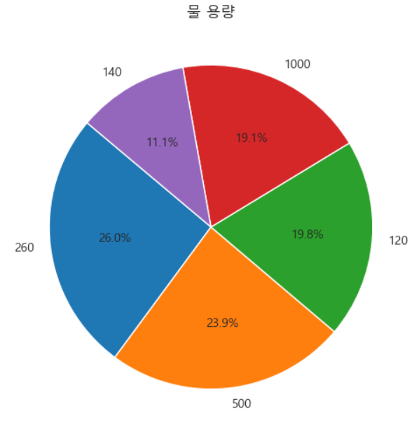

### 1.3 물 온도 선호도 분석

물 온도(desiredtype) 선호도 파이 차트로 시각화


### 1.4 시간별 물 사용 패턴 분석

정수기 사용량을 시간대별로 분석하여 1시간 단위로 사용 패턴 시각화


#### 1.4.1 시간별 전체 사용 수 (1시간 단위)

.png>)

```python
# 'eventTime'을 datetime 형식으로 변환
data['eventTime'] = pd.to_datetime(data['eventTime'])

# 1시간 단위로 전체 사용 수 계산
total_usage = data.set_index('eventTime').resample('1h').size()

# X축 라벨 형식 변경 (일-시 형태로 변환)
formatted_labels = [f"{d.day}-{d.hour}" for d in total_usage.index]

# 막대 그래프 생성 (전체 사용 수)
plt.figure(figsize=(12, 6))
plt.bar(formatted_labels, total_usage.values, width=0.8, color='gray')
plt.ylabel("사용 수")
plt.title("시간별 전체 사용 수 (1시간 단위)")
plt.xticks(rotation=45)
plt.show()
```

#### 1.4.2 온도별 사용 수 분석

각 온도 타입별로 시간대별 사용 패턴

##### 온수(Hot Water) 사용 패턴

.png>)

##### 미온수(Ambient Water) 사용 패턴

.png>)

##### 냉수(Cold Water) 사용 패턴

.png>)


#### 1.4.3 시간별 온도 비율 분석

특정 사용자의 시간대별 온도 선호도를 분석했습니다.

_1_a.png)
_1_b.png)


#### 1.4.4 시간별 전체 사용량 (1시간 단위)


### 1.5 물 용량 및 온도 조합 분석

물 용량과 온도의 조합 분석을 통해 사용자가 선호하는 조합을 파악했습니다.
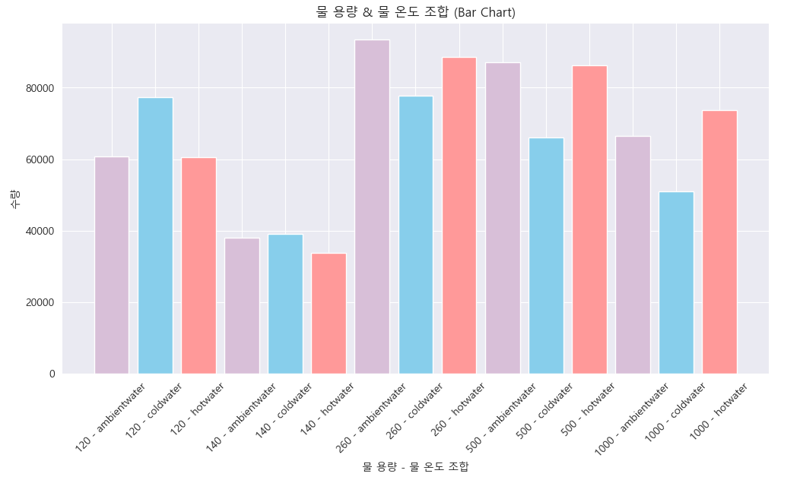


```python
# 물 용량 기준 설정 (정렬 순서)
capacity_order = ['120', '140', '260', '500', '1000']

# 'desiredcapacity'와 'desiredtype'을 조합하여 새로운 범주 생성
data['combined'] = data['desiredcapacity'].astype(str) + " - " + data['desiredtype']

# 각 조합의 개수 세기
combined_counts = data['combined'].value_counts()

# 정렬: 물 용량 순서에 맞춰 정렬
sorted_combined_counts = sorted(
    combined_counts.items(), 
    key=lambda x: (capacity_order.index(x[0].split(" - ")[0]), x[0])
)

# 정렬된 데이터를 분리
sorted_labels = [x[0] for x in sorted_combined_counts]
sorted_values = [x[1] for x in sorted_combined_counts]

# 색상 매핑
bar_colors = [colors[label.split(" - ")[1]] for label in sorted_labels]

# 막대 그래프 (물 용량 & 물 온도 조합)
plt.figure(figsize=(12, 6))
plt.bar(sorted_labels, sorted_values, color=bar_colors)
plt.xlabel("물 용량 - 물 온도 조합")
plt.ylabel("수량")
plt.title("물 용량 & 물 온도 조합 (Bar Chart)")
plt.xticks(rotation=45)
plt.show()
```

### 1.6 사용자별 사용량 분석

사용자별 총 사용량(desiredcapacity 합계)과 온도별 사용량을 분석했습니다.


### 1.7 전체 시간별 사용량 분석

전체 및 온도별 시간대별 사용량(desiredcapacity 합계)을 분석했습니다.
.png)


### 1.8 사용자별 온도 선호도 분석

개별 사용자의 온도 선호도를 파이 차트로 시각화했습니다.

### 1.9 단시간 내 재요청 패턴 분석

1분 이내 정수기 재요청 시 동일한 온도를 선택하는지 분석했습니다.


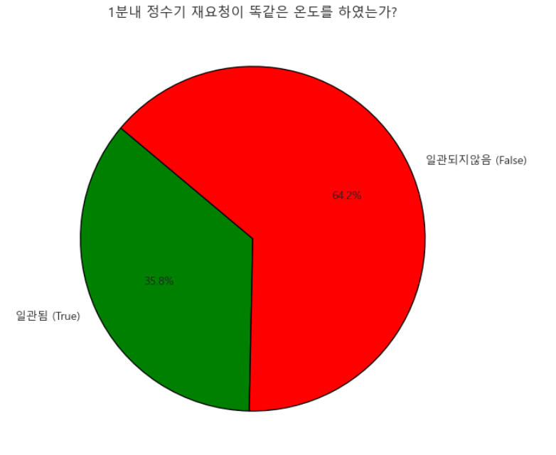
```python
# eventTime을 datetime 형식으로 변환
data['eventTime'] = pd.to_datetime(data['eventTime'])

# 다음 행과의 시간 차이를 분 단위로 계산
data['timediff'] = (data['eventTime'].shift(-1) - data['eventTime']).dt.total_seconds() / 60

# 그룹 번호 할당
data['group'] = 0
group_id = 0

# 그룹화 진행
for i in range(len(data)):
    data.loc[i, 'group'] = group_id
    if data.loc[i, 'timediff'] > 1:
        group_id += 1

# 그룹별 desiredtype 일관성 확인 함수
def check_group_consistency(data):
    return data.groupby('group')['desiredtype'].nunique() == 1

# 일관성 확인 및 파이 차트 생성
group_consistency = check_group_consistency(data)
true_count = group_consistency.sum()
false_count = len(group_consistency) - true_count

plt.figure(figsize=(7, 7))
plt.pie(
    [true_count, false_count], 
    labels=['일관됨 (True)', '일관되지않음 (False)'], 
    autopct='%1.1f%%', 
    colors=['green', 'red'], 
    startangle=140, 
    wedgeprops={'edgecolor': 'black'}
)
plt.title("1분내 정수기 재요청이 똑같은 온도를 하였는가?")
plt.show()
```

## 2. 주요 발견점

### 2.1 시간대별 사용 패턴

### 2.2 온도별 사용 패턴


### 2.3 출수량 분석


## 3. 결론


**추후 작성**


# 2. 생성 데이터 EDA
## 2.1 데이터 생성

### 공통 패턴 가정(노이즈 생성 방법)

- 하루 출수량을 0.6~1.3L의 물을 마신다고 가정.
- 주 패턴이 되는 시간에 나눠서 0.5L의 물을 마신다고 가정.

| 요청 횟수 | 출수량 범위        |
|:--------:|:-----------------:|
| 1     | 0.45L ~ 0.5L  |
| 2     | 0.2L ~ 0.25L  |
| 3     | 0.15L ~ 0.2L  |
| 4     | 0.08L ~ 0.13L |
 
- 주패턴에서 물의 요청 횟수는 거의 동일하다고 가정
- 주 패턴 시간은 random으로 시작 시간과 범위를 설정해 거기에서 n회 요청하는 방식으로 생성(30분 단위)
- 하루 최대 8번의 물을 마신다고 가정.


### 패턴 A ( 저녁 시간에 물을 많이 마시는 사람)
- 저녁 시간

| 시작하는 시간 범위    | 요청하는 시간 범위    | 출수량 범위  |
|:--------:|:-----------------:|:-----------------:|
| 17시 ~ 18시 30분 | 3시간 ~ 4시간 30분 | 1회 ~ 4회 |

- 생성 코드
```python
start_hour2 = int(np.random.uniform(34, 38))
eating_hour2 = int(np.random.uniform(6, 10))
boost_hours = [list(range(start_hour2, start_hour2 + eating_hour2 + 1))]
count = [np.random.randint(1, 5)]

meta_info['start_hours'].append(start_hour2)
meta_info['eating_hours'].append(eating_hour2)
meta_info['count'] = count

waterForm = [(0, 0), (450, 500), (200, 250), (150, 200), (80, 130)]
for i in range(len(boost_hours)):
    count = fixed_count[i] if i < len(fixed_count) else 0
    if count == 0:
        continue
    times = np.random.choice(boost_hours[i], size=count, replace=False)
    for hour in times:
        usage[hour] += int(np.random.uniform(*waterForm[count])) // 10 * 10
max_drinks = 8 - sum(fixed_count)
base_hours = list(set(range(48)) - set().union(*boost_hours))
base_drinks = np.random.randint(min(3, max_drinks), max(3, max_drinks) + 1)
if base_hours:
    times = np.random.choice(base_hours, size=base_drinks, replace=False)
    for hour in times:
        usage[hour] += int(np.random.uniform(80.0, 130.0)) // 10 * 10
```

### 패턴 B ( 점심, 저녁 시간에 물을 많이 마시는 사람)
- 점심 시간

| 시작하는 시간 범위    | 요청하는 시간 범위    | 출수량 범위  |
|---------------|---------------|---------|
| 10시 ~ 12시 30분 | 3시간 ~ 4시간 30분 | 1회 ~ 4회 |

- 저녁 시간

| 시작하는 시간 범위    | 요청하는 시간 범위    | 출수량 범위  |
|---------------|---------------|---------|
| 17시 ~ 18시 30분 | 3시간 ~ 4시간 30분 | 1회 ~ 4회 |

- 생성 코드
```python

start_hour1 = int(np.random.uniform(20, 26))
eating_hour1 = int(np.random.uniform(6, 10))
start_hour2 = int(np.random.uniform(34, 38))
eating_hour2 = int(np.random.uniform(6, 10))

boost_hours = [
    list(range(start_hour1, start_hour1 + eating_hour1 + 1)),
    list(range(start_hour2, start_hour2 + eating_hour2 + 1))
]
x = np.random.randint(1, 5)
if x != 4:
    count = [x, np.random.randint(1, 5)]
else:
    count = [x, np.random.randint(1, 4)]

meta_info['start_hours'] = [start_hour1, start_hour2]
meta_info['eating_hours'] = [eating_hour1, eating_hour2]
meta_info['count'] = count

waterForm = [(0, 0), (450, 500), (200, 250), (150, 200), (80, 130)]
for i in range(len(boost_hours)):
    count = fixed_count[i] if i < len(fixed_count) else 0
    if count == 0:
        continue
    times = np.random.choice(boost_hours[i], size=count, replace=False)
    for hour in times:
        usage[hour] += int(np.random.uniform(*waterForm[count])) // 10 * 10
max_drinks = 8 - sum(fixed_count)
base_hours = list(set(range(48)) - set().union(*boost_hours))
base_drinks = np.random.randint(min(3, max_drinks), max(3, max_drinks) + 1)
if base_hours:
    times = np.random.choice(base_hours, size=base_drinks, replace=False)
    for hour in times:
        usage[hour] += int(np.random.uniform(80.0, 130.0)) // 10 * 10
```

### 패턴 C ( 점심 시간에 물을 많이 마시는 사람)
- 점심 시간

  | 시작하는 시간 범위    | 요청하는 시간 범위    | 출수량 범위  |
  |---------------|---------------|---------|
  | 10시 ~ 12시 30분 | 3시간 ~ 4시간 30분 | 1회 ~ 4회 |

- 생성 코드
```python

start_hour1 = int(np.random.uniform(20, 26))
eating_hour1 = int(np.random.uniform(6, 10))
boost_hours = [list(range(start_hour1, start_hour1 + eating_hour1 + 1))]
count = [np.random.randint(1, 5)]

meta_info['start_hours'].append(start_hour1)
meta_info['eating_hours'].append(eating_hour1)
meta_info['count'] = count

waterForm = [(0, 0), (450, 500), (200, 250), (150, 200), (80, 130)]
for i in range(len(boost_hours)):
    count = fixed_count[i] if i < len(fixed_count) else 0
    if count == 0:
        continue
    times = np.random.choice(boost_hours[i], size=count, replace=False)
    for hour in times:
        usage[hour] += int(np.random.uniform(*waterForm[count])) // 10 * 10
max_drinks = 8 - sum(fixed_count)
base_hours = list(set(range(48)) - set().union(*boost_hours))
base_drinks = np.random.randint(min(3, max_drinks), max(3, max_drinks) + 1)
if base_hours:
    times = np.random.choice(base_hours, size=base_drinks, replace=False)
    for hour in times:
        usage[hour] += int(np.random.uniform(80.0, 130.0)) // 10 * 10
```

### 패턴 D ( 아침 시간에 물을 많이 마시는 사람)- 신규 패턴
- 점심 시간

  | 시작하는 시간 범위    | 요청하는 시간 범위    | 출수량 범위  |
  |---------------|---------------|---------|
  | 5시 ~ 7시 30분 | 3시간 ~ 4시간 30분 | 1회 ~ 4회 |

- 생성 코드
```python
usage = np.zeros(48)
start_hour3 = int(np.random.uniform(10, 16))
eating_hour3 = int(np.random.uniform(6, 10))
meta_info = {
    'count': [count],
    'start_hours': [],
    'eating_hours': []
}

if 'D' in pattern_type:
    boost_hours = [list(range(start_hour3, start_hour3 + eating_hour3 + 1))]

waterForm = [(0, 0), (450, 500), (200, 250), (150, 200), (80, 130)]

for i in range(len(boost_hours)):
    pattern_drink_times = np.random.choice(boost_hours[i], size=count, replace=False)
    for hour in pattern_drink_times:

        usage[hour] += int(np.random.uniform(waterForm[count][0], waterForm[count][1])) // 10 * 10

max_drinks = 8 - count
base_hours = list(set(range(48)) - set(boost_hours[0]))
base_drinks = np.random.randint(min(3, max_drinks), max(3, max_drinks) + 1)
drink_times = np.random.choice(base_hours, size=base_drinks, replace=False)

for hour in drink_times:
    drink_usage = int(np.random.uniform(80.0, 130.0)) // 10 * 10
    usage[hour] += drink_usage
meta_info['start_hours'].append(start_hour3)
meta_info['eating_hours'].append(eating_hour3)
```

## 2.2 데이터 처리(A, B, C)
### 데이터 처리 방법
1. DBSCAN을 활용한 클러스터링, Silhouette Score을 활용한 응집도 확인 및 대표 패턴 찾기
2. DTW(Dynamic Time Warping)를 호라용한 유사도 측정
  - 시게열간 데이터 간의 유사성을 비교하기 위한 알고리즘
  - 데이터 간의 속도나 길이가 달라도 이것을 고려하여 유사성을 측정하기 때문에 시계열 데이터 분석에 많이 활용
  - 시간 축 상으로 포인트의 위치는 다르지만 앞이나 뒤에 밀려있고 사이즈가 달라지는 경우, 데이터간의 시계열을 비틀어 유사도를 측정 

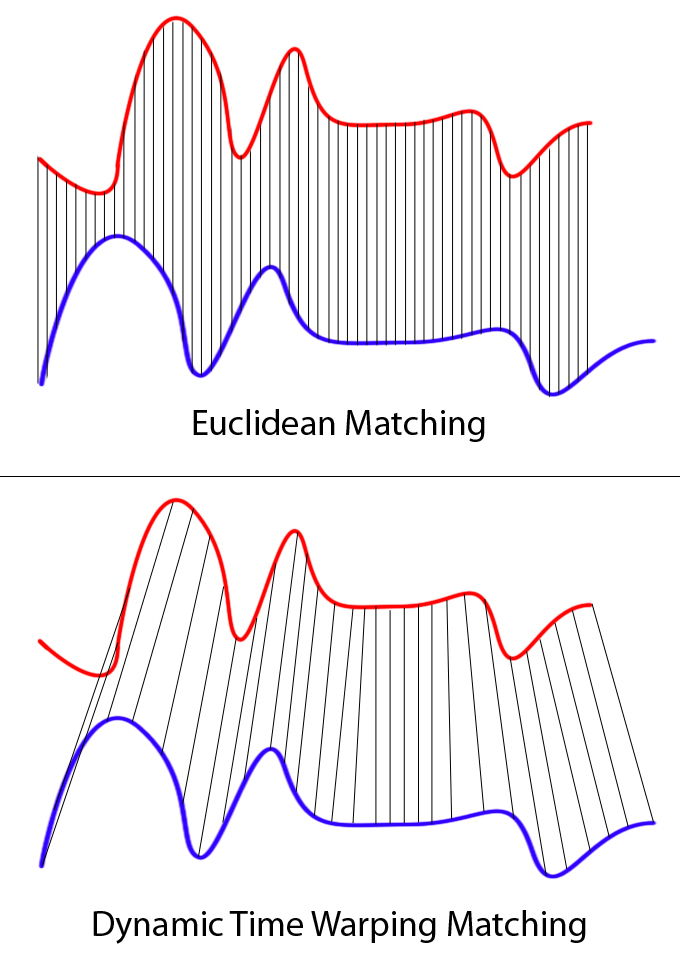

3. IQR 활용한 데이터 이상치 제거

```python
# 하루 단위 벡터 생성
daily_vectors = []
for (pid, date), group in df.groupby(['person_id', 'date']):
    sorted_group = group.sort_values(by=['hour', 'minute'])
    vec = sorted_group['amount'].values
    if len(vec) == 48:
        daily_vectors.append(vec)
daily_vectors = np.array(daily_vectors)

if len(daily_vectors) == 0:
    print(f"[{label}] No valid daily vectors.")
    return

# 정규화
daily_vectors_norm = normalize_each_day_minmax(daily_vectors)

# DBSCAN 군집화
dbscan = DBSCAN(eps=0.9, min_samples=3)

labels = dbscan.fit_predict(daily_vectors_norm)

# PCA 시각화를 위한 변환
pca = PCA(n_components=2)
pca_result = pca.fit_transform(daily_vectors_norm)

# 유효 벡터만 (노이즈 제외)
valid_indices = labels != -1
valid_vectors = daily_vectors_norm[valid_indices]
valid_labels = labels[valid_indices]

if len(valid_vectors) == 0:
    print(f"[{label}] No clusters found.")
    return

# ------------------- (1) Silhouette Score 계산 -------------------
sil_samples = silhouette_samples(valid_vectors, valid_labels)
sil_scores = {
    cluster_id: np.mean(sil_samples[valid_labels == cluster_id])
    for cluster_id in np.unique(valid_labels)
}

# 표로 출력
sil_table = pd.DataFrame({
    'Cluster': list(sil_scores.keys()),
    'Silhouette Score': list(sil_scores.values())
}).sort_values(by='Silhouette Score', ascending=False)

print(f"\n[{label}] Cluster-wise Silhouette Scores:")
display(sil_table)

# ------------------- (2) 가장 응집도 높은 클러스터 → 대표 벡터 -------------------
best_cluster = sil_table.iloc[0]['Cluster']
best_vectors = valid_vectors[valid_labels == best_cluster]

# 가장 대표적인 실제 벡터 찾기
dtw_matrix = np.zeros((len(best_vectors), len(best_vectors)))
for i in range(len(best_vectors)):
    for j in range(i + 1, len(best_vectors)):
        dist = dtw.distance(best_vectors[i], best_vectors[j])
        dtw_matrix[i, j] = dist
        dtw_matrix[j, i] = dist
avg_dtw = dtw_matrix.mean(axis=1)
center_idx = np.argmin(avg_dtw)
center_vector = best_vectors[center_idx]

# 전체 데이터에 대한 DTW 계산
cum_center = cumulative_minmax(center_vector)
dtw_cum_distances = [dtw.distance(cum_center, cumulative_minmax(vec)) for vec in daily_vectors_norm]
# 일반 패턴으로 DTW해본 결과 보여주기 위해 저장
dtw_plain_distances = [dtw.distance(center_vector, vec) for vec in daily_vectors_norm]

# ------------------- 이상치 제거 (IQR 방식) -------------------
q1 = np.percentile(dtw_cum_distances, 25)
q3 = np.percentile(dtw_cum_distances, 75)
iqr = q3 - q1
upper_bound = q3 + 0.5 * iqr

# 이상치 마스크 및 인덱스 추출
outlier_mask = np.array(dtw_cum_distances) > upper_bound

# ------------------- 이상치 제거 (상위 5% 제거 방식) -------------------

# threshold = np.percentile(dtw_cum_distances, 95)
# outlier_mask = np.array(dtw_cum_distances) > threshold

# ------------------- (3-2) 전체 점 + DTW 이상치 시각화 -------------------
outlier_indices = np.where(outlier_mask)[0]
non_outlier_indices = np.where(~outlier_mask)[0]
# 이상치 제외한 데이터 추출
filtered_vectors = daily_vectors[non_outlier_indices]  # 원본 벡터 사용 (정규화 X)
person_day_info = []
# 각 벡터가 어떤 사람/날짜에 해당하는지 매칭
idx = 0
for (pid, date), group in df.groupby(['person_id', 'date']):
if len(group) == 48:
if idx in non_outlier_indices:
start_hours = group['start_hours'].iloc[0]
eating_hours = group['eating_hours'].iloc[0]
counts = group['counts'].iloc[0]
person_day_info.append((pid, date, start_hours, eating_hours, counts))
idx += 1
```

### A 이상치 처리
1. DBSCAN을 활용한 클러스터링, Silhouette Score을 활용한 응집도 확인 및 대표 패턴 찾기

- 실루엣 스코어

| Cluster | Silhouette Score |
|:--------:|:-----------------:|
| 35      | 	0.583731        |
| 24      | 	0.583714        |
| 8       | 	0.520445        |
| 0       | 	0.503378        |
| 9       | 	0.499320        |
| ...     | 	...             |
| 27      | 	0.031499        |
| 52      | 	0.017806        |
| 20      | 	0.013090        |
| 25      | 	0.009538        |
| 37      | 	-0.000248       |

- 대표 패턴

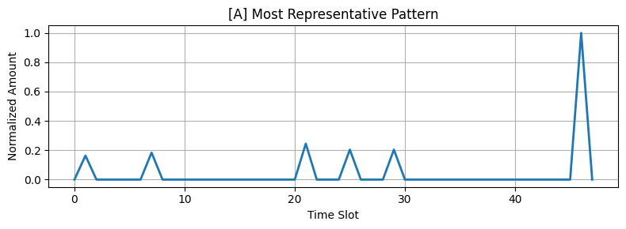

2. 누적합으로 DTW와 시퀀스 그대로 DTW를 계산한 결과

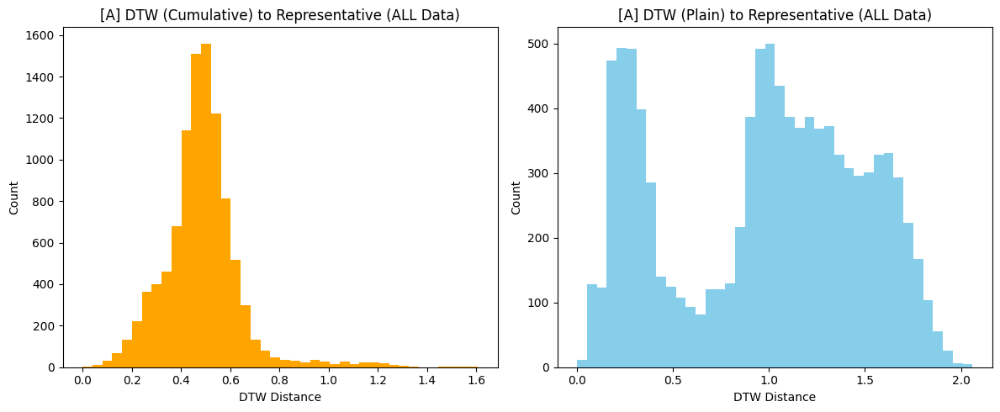
3. IQR 활용한 데이터 이상치 제거


### B 이상치 처리
1. DBSCAN을 활용한 클러스터링, Silhouette Score을 활용한 응집도 확인 및 대표 패턴 찾기

- 실루엣 스코어

| Cluster | Silhouette Score |
|---------|------------------|
|4|	0.538214|
|5|	0.526342|
|6|	0.505096|
|3|	0.496367|
|1|	0.474208|
|2|	0.472166|
|0|	-0.033806|

- 대표 패턴
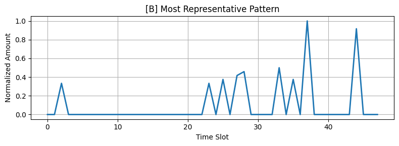

2. 누적합으로 DTW와 시퀀스 그대로 DTW를 계산한 결과
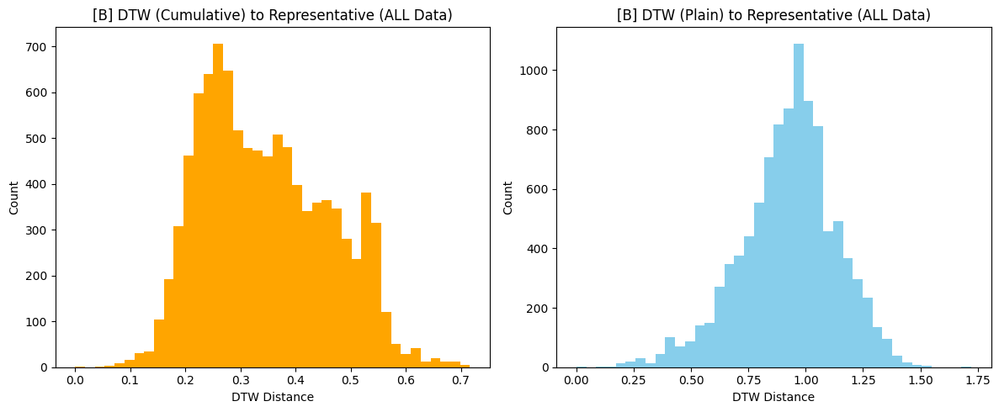

3. IQR 활용한 데이터 이상치 제거


### C 이상치 처리
1. DBSCAN을 활용한 클러스터링, Silhouette Score을 활용한 응집도 확인 및 대표 패턴 찾기

- 실루엣 스코어

| Cluster | Silhouette Score |
|---------|------------------|
|24|	0.577219|
|15|	0.559158|
|12|	0.517747|
|8|	0.506237|
|20	|0.499416|
|...|	...|
|19|	0.058651|
|23|	0.043572|
|57|	0.033175|
|28|	-0.000347|
|32|	-0.036647|


- 대표 패턴
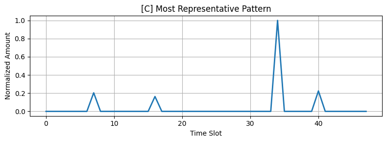

2. 누적합으로 DTW와 시퀀스 그대로 DTW를 계산한 결과
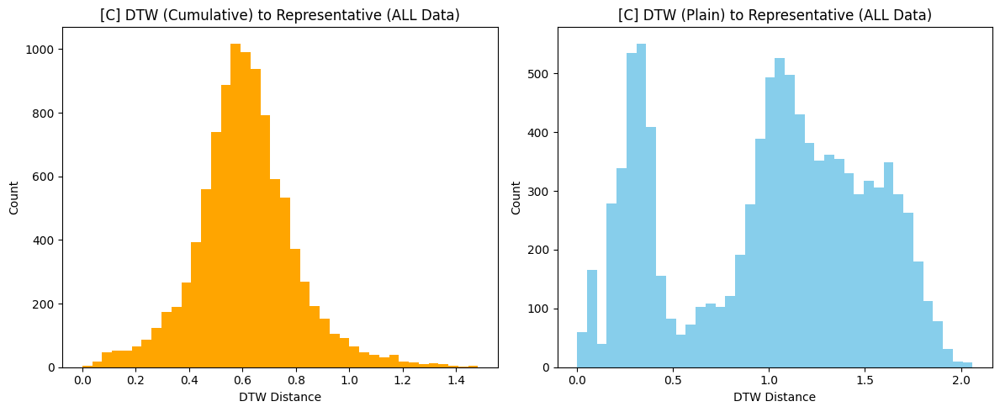
3. IQR 활용한 데이터 이상치 제거


# 3. 생성 데이터 ML 모델 학습(민철)
## 3.1 패턴 분류기 생성
### 3.1.1 초기 분류 모델 생성(A,B,C 분류기)
1. 분류기 모델(AutoEncoder)
- 각 패턴 별 AE 모델 생성 및 `데이터 평균 + 1,5 * 표준편차`를 임계값으로 해서 87%의 데이터 안에 들어오면 해당 모델로 분류
- 48차원(24시간 30분 단위)-> (nn모델) -> 24차원-> RelU -> (nn모델) -> 12차원 -> (nn모델) -> RelU -> 24차원 -> (nn모델)-> 48차원

2. 5일치 누적합의 normalization한 값을 이용해 AE 학습

3. 학습 결과
Pattern A ▶ Accuracy: 87.73%, Unknown: 8.95%
Pattern B ▶ Accuracy: 88.20%, Unknown: 9.18%
Pattern C ▶ Accuracy: 90.03%, Unknown: 8.62%

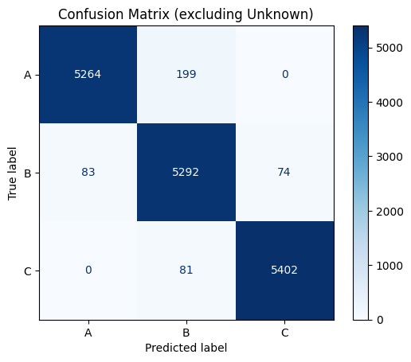

```python
# 2. Define Autoencoder
class Autoencoder(nn.Module):
    def __init__(self, input_dim=48, latent_dim=12):
        super().__init__()
        self.encoder = nn.Sequential(
            nn.Linear(input_dim, 24),
            nn.ReLU(),
            nn.Linear(24, latent_dim)
        )
        self.decoder = nn.Sequential(
            nn.Linear(latent_dim, 24),
            nn.ReLU(),
            nn.Linear(24, input_dim)
        )

    def forward(self, x):
        return self.decoder(self.encoder(x))

# 3. Train AE per pattern
def train_autoencoder(model, data, epochs=150, lr=1e-3):
    criterion = nn.MSELoss()
    optimizer = optim.Adam(model.parameters(), lr=lr)
    model.train()
    inputs = torch.tensor(data, dtype=torch.float32)

    for _ in range(epochs):
        optimizer.zero_grad()
        outputs = model(inputs)
        loss = criterion(outputs, inputs)
        loss.backward()
        optimizer.step()

patterns = ['A', 'B', 'C']
models = {}
thresholds = {}

for pattern in patterns:
    print(f"Training AE for Pattern {pattern}")
    data = X_5day[y_5day == pattern]
    model = Autoencoder()
    train_autoencoder(model, data)
    models[pattern] = model

    model.eval()
    with torch.no_grad():
        outputs = model(torch.tensor(data, dtype=torch.float32)).numpy()
    mses = [mean_squared_error(x, y) for x, y in zip(data, outputs)]
    thresholds[pattern] = np.mean(mses) + 1.5 * np.std(mses) # 1.5 87%, 2 90%

# 4. Prediction function
def predict(sample):
    errors = {}
    for p, model in models.items():
        model.eval()
        with torch.no_grad():
            x = torch.tensor(sample, dtype=torch.float32).unsqueeze(0)
            recon = model(x).squeeze(0).numpy()
            mse = mean_squared_error(sample, recon)
            errors[p] = (mse, recon)

    best_p = min(errors, key=lambda k: errors[k][0])
    best_mse = errors[best_p][0]

    if best_mse > thresholds[best_p]:
        return "Unknown", errors[best_p][1], best_mse
    else:
        return best_p, errors[best_p][1], best_mse


predicted_labels = []
reconstruction_errors = []

for sample in X_5day:
    pred, recon, mse = predict(sample)
    predicted_labels.append(pred)
    reconstruction_errors.append(mse)

predicted_labels = np.array(predicted_labels)

from collections import Counter

print("\n📊 패턴별 예측 결과:")
for pattern in patterns:
    idxs = np.where(y_5day == pattern)[0]
    total = len(idxs)
    pred_counts = Counter(predicted_labels[idxs])
    unknown_count = pred_counts.get('Unknown', 0)
    correct_count = pred_counts.get(pattern, 0)
    acc = correct_count / total
    unknown_ratio = unknown_count / total

    print(f"Pattern {pattern} ▶ Accuracy: {acc:.2%}, Unknown: {unknown_ratio:.2%}")
```

### 3.1.2 신규 패턴 인식(A,B,C 분류기)
1. D 패턴 테스트
```
예측된 패턴: Unknown
MSE: 0.08354 
Threshold 기준: 이상 탐지됨 (Unknown)
```
2. 신규 D AE 모델 및 ThreshHold 저장
- 1000명 30일 -> 총 3000개의 데이터가 있으면, AE 모델 생성 가능하다.

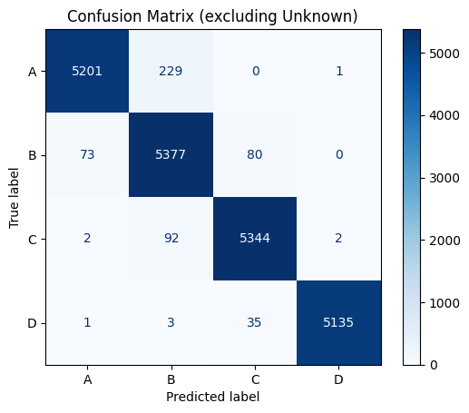

## 3.2 패턴별 파운데이션 모델 생성

### 3.2.1 파운데이션 모델 및 평가 방법
- 모델: XGBoost
Gradient Boosting 기반의 트리 앙상블 모델로, 높은 예측 성능과 안정적인 학습 속도를 제공함.
개별 트리를 순차적으로 학습하면서 이전 트리의 오차(잔차)를 줄이는 방향으로 최적화함.
과적합을 방지하기 위한 정규화 기능과 다양한 하이퍼파라미터 조정이 가능해 실무에서 널리 사용됨.

- K-Fold 교차 검증
전체 데이터를 K개의 부분(fold)로 나눈 뒤, K-1개로 모델을 학습하고 남은 1개로 검증을 수행.
이 과정을 K번 반복하며, 모든 fold에서 얻은 평가 지표의 평균을 최종 성능으로 사용함.
데이터의 편향을 줄이고 모델의 일반화 성능을 안정적으로 평가할 수 있음.
일반적으로 K=5 또는 K=10이 자주 사용됨.

-정확도 측정 방법

|       지표	       |설명|	수식|
|:---------------:|:----:|:----:|
| R² Score (결정계수) |	모델이 종속 변수의 분산을 얼마나 잘 설명하는지를 나타냄. 1에 가까울수록 예측력이 높음.| 	$R^2 = 1 - \frac{\sum (y_i - \hat{y}_i)^2}{\sum (y_i - \bar{y})^2}$| 
| RMSE (Root Mean Square Error)| 	예측값과 실제값의 오차를 제곱하여 평균한 후 제곱근을 취한 값. 값이 작을수록 예측 정확도가 높음.| 	$RMSE = \sqrt{\frac{1}{n} \sum_{i=1}^{n} (y_i - \hat{y}_i)^2}$| 
| Accuracy (10% 기준)	| 예측값이 실제값의 ±10% 범위 내에 들어오는 비율. 회귀 문제에서의 정밀도 개념으로 활용.| 	$Accuracy = \frac{\text{10% 이내 예측 수}}{\text{전체 샘플 수}}$| 

### 3.2.2 정수기 데이터 Feature 정의표

| Feature 이름 | 데이터 타입 | 유효 범위 | 설명 |
|-------------|------------|----------|------|
| person_id | BIGINT UNSIGNED | - | 사용자 번호 |
| time | DATETIME | - | 출수 시간 |
| output_seq | INT | 1 ~ 100 | 하루 내 출수 순서 |
| ratio_to_prev_day | FLOAT | 0 ~ 10 | 현재 시점 이전까지의 누적 출수량 / 이전날 총 출수량 |
| ratio_prev_to_total | FLOAT | 0 ~ 10 | 이전날 현재시간까지 마신 양 / 이전날 총 출수량 |
| time_diff_prev_outputs | TIME | 00:00 ~ 24:00 | 현재 출수 시간 - 이전 출수 시간 |
| prev_sum | INT | 0 ~ 10000 | 현재 시점 이전까지의 누적 출수량 |
| prev_day_mean | FLOAT | 0 ~ 10000 | 이전날 출수량의 평균 |
| prev_day_std | FLOAT | 0 ~ 10000 | 이전날 출수량의 표준편차 |
| prev_day_total | INT | 0 ~ 10000 | 이전날 출수량의 총 합 |
| slope_prev_day_n_n_minus_1 | INT | -10000 ~ 10000 | 이전날 같은 순서의 출수량과 그 이전 출수량의 차이 |
| slope_prev_day_n_minus_1_n_minus_2 | INT | -10000 ~ 10000 | 이전날 같은 순서의 출수량과 그 이전 출수량의 차이 와 이전날 같은 순서의 이전 출수량과 그 이전 시점의 출수량 차이 |
| avg_change_rate | FLOAT | 0 ~ 10000 | 이전날 그래프의 변화량 평균 |
| prev_output | INT | 0 ~ 10000 | 현재 시점 이전 번째의 출수량 |
| prev_prev_output | INT | 0 ~ 10000 | 현재 시점 이전의 이전 번째의 출수량 |

### 3.2.3 BaseModel HyperParameter

```python
'tree_method': 'hist',
'device': 'cuda',
'objective': 'reg:squarederror',
'max_depth': 6,
'random_state': 42
```


### 3.2.4 학습 코드
```python

# XGBoost 모델 학습
xgb_dtrain_all = xgb.DMatrix(X_all.values, label=y_all.values, feature_names=features)
xgb_model_all = xgb.train(params, xgb_dtrain_all, num_boost_round=100)

# 모델 저장
model_path_all = os.path.join(model_dir_2, 'all.model')
xgb_model_all.save_model(model_path_all)
print(f"전체 데이터 모델 저장 완료: {model_path_all}")

# 패턴 A, B, C, D 모두 사용
patterns_2 = ['A', 'B', 'C', 'D']
df_2 = df[df['pattern'].isin(patterns_2)].copy()
df_cudf_2 = cudf.DataFrame.from_pandas(df_2)

print(f"블록 2 데이터 크기 (A,B,C,D 패턴): {len(df_2)}")

# K-Fold 교차 검증 - 간소화된 평가
X_pd_all = df_2[features]
y_pd_all = df_2['amount']

kfold = KFold(n_splits=5, shuffle=True, random_state=42)
r2_scores_all = []
rmse_scores_all = []
accuracy_all = []  # 10% 이내 오차 비율

for train_idx, test_idx in kfold.split(X_pd_all):
    X_train, X_test = X_pd_all.iloc[train_idx], X_pd_all.iloc[test_idx]
    y_train, y_test = y_pd_all.iloc[train_idx], y_pd_all.iloc[test_idx]

    # 모델 학습 및 예측
    dtrain_cv = xgb.DMatrix(cp.asarray(X_train.values), label=cp.asarray(y_train.values))
    dtest_cv = xgb.DMatrix(cp.asarray(X_test.values))
    xgb_model_cv = xgb.train(params, dtrain_cv, num_boost_round=100)
    y_pred = cp.asnumpy(xgb_model_cv.predict(dtest_cv))

```
# 4. Voice ID 

## 4.0 Voice ID 데이터

### 4.0.1데이터 수집
- 데이터는 AI Hub에서 제공하는 한국어 화자 인식 데이터셋을 사용하였습니다.
(https://www.aihub.or.kr/aihubdata/data/view.do?currMenu=115&topMenu=100&aihubDataSe=data&dataSetSn=537)

위 데이터 셋 중 LabelText = '두비두'를 평균 10회 정도 발화한 음성 데이터셋을 활용합니다.

## 4.1 특징 추출 방법
### 4.1.1 MFCC 음성 특징 추출
  - MFCC는 오디오 신호에서 추출할 수 있는 feature로, 소리의 고유한 특징을 나타내는 수치입니다.
  - 주로 음성 인식, 화자 인식, 음성 합성, 음악 장르 분류 등 오디오 도메인의 문제를 해결하는 데 사용됩니다.
  - 먼저 MFCC를 쉽게 이해하기 위해 MFCC의 실제 사용 예시를 들어보겠습니다.
  - 각 음성 파일에서 시작 시점과 종료 시점을 기준으로 무음 구간을 제거합니다.
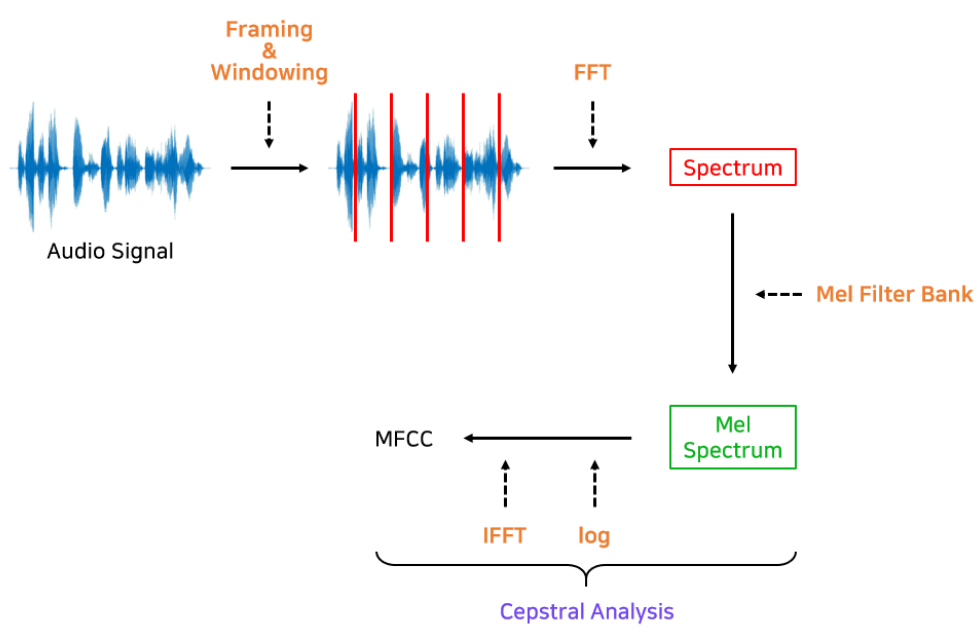
  1. 오디오 신호를 프레임별(보통 20ms - 40ms)로 나누어 FFT를 적용해 Spectrum을 구한다.
  2. Spectrum에 Mel Filter Bank를 적용해 Mel Spectrum을 구한다.
  3. Mel Spectrum에 Cepstral 분석을 적용해 MFCC를 구한다.
  
- 추가 노이즈 제거
 - 신호대잡음비(SNR)가 5dB 이하인 데이터는 제외합니다 (실제 적용 시 제거된 샘플은 거의 없음).

- MFCC 특징 추출 코드
```python
import os
import librosa
import numpy as np
import h5py
import json
import re
import noisereduce as nr
import soundfile as sf

# ✅ 설정
SAVE_WAV = True  # 전처리된 .wav 파일 저장 여부

# ✅ 디렉토리 설정
input_base_dir = "/content/drive/MyDrive/SLink_PJT/Data/voiceData/source"
label_base_dir = "/content/drive/MyDrive/SLink_PJT/Data/voiceData/label"
h5_output_base_dir = "/content/drive/MyDrive/SLink_PJT/Data/MFCC_noiserm_Features"
wav_output_base_dir = "/content/drive/MyDrive/SLink_PJT/Processed_WAV"
status_file = "/content/drive/MyDrive/SLink_PJT/Data/process_noiserm_MFCC.json"

# ✅ 진행 상태 로드 (이미 처리된 파일 리스트 불러오기)
def load_progress():
  if os.path.exists(status_file):
    with open(status_file, "r") as f:
      return json.load(f)
  return {}

# ✅ 진행 상태 저장
def save_progress(processed_files):
  with open(status_file, "w") as f:
    json.dump(processed_files, f, indent=4)

# ✅ 처리된 파일 불러오기
processed_files = load_progress()

# ✅ JSON 데이터 로드
def load_label_data(file_path):
  label_path = file_path.replace(input_base_dir, label_base_dir).replace(".wav", ".json")
  if not os.path.exists(label_path):
    raise Exception(f"⚠️ 라벨링 파일을 찾을 수 없음: {label_path}")

  with open(label_path, "r") as f:
    label_data = json.load(f)

  try:
    snr = int(label_data["Wav"]["SignalToNoiseRatio"].replace("dB", ""))
    speech_start = float(label_data["Other"]["SpeechStart"])
    speech_end = float(label_data["Other"]["SpeechEnd"])
    age_group = label_data["Speaker"]["Age"]
    noise_env = label_data["Environment"]["NoiseEnviron"]
    recording_env = label_data["Environment"]["RecordingEnviron"]
  except KeyError as e:
    raise Exception(f"⚠️ 라벨링 데이터 오류: {e} in {label_path}")

  return {
    "snr": snr,
    "speech_start": speech_start,
    "speech_end": speech_end,
    "age_group": age_group,
    "noise_env": noise_env,
    "recording_env": recording_env
  }

# ✅ 오디오 전처리 (발화 구간 자르기 → 노이즈 제거)
def preprocess_audio(y, sr, label_data):
  # ✅ 발화 구간 자르기 (SpeechStart ~ SpeechEnd)
  start_sample = int(label_data["speech_start"] * sr)
  end_sample = int(label_data["speech_end"] * sr)
  y_cropped = y[start_sample:end_sample]

  # ✅ 노이즈 제거 적용
  y_denoised = nr.reduce_noise(y=y_cropped, sr=sr, stationary=True)

  return y_denoised  # ✅ trim()을 적용하지 않고 그대로 반환

# ✅ MFCC 추출 및 저장 함수 (중복 처리 방지 기능 추가)
def process_and_save_mfcc(file_path):
  path_parts = file_path.split('/')
  if len(path_parts) < 6:
    raise Exception(f"⚠️ 파일 경로 오류: {file_path}")

  room_id, call_label, date, user_id, file_name = path_parts[-5], path_parts[-4], path_parts[-3], path_parts[-2], path_parts[-1]

  if call_label != "call":
    raise Exception(f"⚠️ 예상과 다른 폴더 구조: {file_path}")

  file_name_without_ext = os.path.splitext(file_name)[0]

  # ✅ 이미 처리된 파일인지 확인 후 스킵
  if file_path in processed_files:
    print(f"🔄 Skipping (Already Processed): {file_path}")
    return

  # ✅ 라벨링 데이터 로드
  label_data = load_label_data(file_path)

  # ✅ 오디오 로드 및 전처리 적용
  y, sr = librosa.load(file_path, sr=None)
  y_processed = preprocess_audio(y, sr, label_data)

  # ✅ MFCC 변환
  mfcc = librosa.feature.mfcc(y=y_processed, sr=sr, n_mfcc=14)

  # ✅ 저장할 경로 설정
  h5_save_dir = os.path.join(h5_output_base_dir, room_id, call_label, date, user_id)
  os.makedirs(h5_save_dir, exist_ok=True)
  h5_save_path = os.path.join(h5_save_dir, f"{file_name_without_ext}.h5")

  wav_save_dir = os.path.join(wav_output_base_dir, room_id, call_label, date, user_id)
  os.makedirs(wav_save_dir, exist_ok=True)
  wav_save_path = os.path.join(wav_save_dir, f"{file_name_without_ext}_processed.wav")

  # ✅ 전처리된 .wav 파일 추가 저장
  if SAVE_WAV:
    sf.write(wav_save_path, y_processed, sr)
    print(f"✅ 저장 완료 (WAV): {wav_save_path}")

  # ✅ HDF5 파일 저장
  with h5py.File(h5_save_path, "a") as h5f:
    h5f.create_dataset(file_name_without_ext, data=mfcc)
    h5f[file_name_without_ext].attrs["sr"] = sr
    h5f[file_name_without_ext].attrs["file_path"] = file_path
    h5f[file_name_without_ext].attrs.update(label_data)

  # ✅ 처리된 파일 목록에 추가 후 저장
  processed_files[file_path] = h5_save_path
  save_progress(processed_files)

  print(f"✅ 저장 완료 (HDF5): {h5_save_path}")

# ✅ 모든 WAV 파일 처리 함수 (중복 방지 기능 추가)
def process_all_wav_files(root_dir):
  file_count = 0
  for subdir, _, files in os.walk(root_dir):
    for file in files:
      if file.endswith(".wav"):
        file_path = os.path.join(subdir, file)
        process_and_save_mfcc(file_path)
        file_count += 1
        if file_count % 100 == 0:
          print(f"📢 Processed {file_count} files...")

  print(f"🎉 전체 변환 완료! 총 {file_count}개 파일을 변환했습니다.")

# 실행
process_all_wav_files(input_base_dir)


```
### 4.1.2 Feature 추출
- MFCC는 (n x 14) 형태로 추출되며, n은 프레임 수입니다.
- 프레임 단위에서 평균/표준편차를 구해 (2 x 14)로 요약합니다.
- 이를 다시 사용자 단위로 평균하여 최종 feature로 사용합니다.

- Feature 추출 코드
```python
import os
import h5py
import numpy as np
import pandas as pd
import json

# ✅ CPU 설정
print("✅ 연산 장치: CPU")

# ✅ 경로 설정
root_dir = "/content/drive/MyDrive/SLink_PJT/Data/MFCC_noiserm_Features"
label_base_dir = "/content/drive/MyDrive/SLink_PJT/Data/voiceData/label"
ENERGY_THRESHOLD = 1e-3

user_features_dict = {}
user_gender_dict = {}

# ✅ 성별 숫자 변환 함수
def gender_to_numeric(gender_str):
    return 1 if gender_str.lower().startswith('m') else 0  # Male:1, Female:0

# ✅ MFCC CPU 처리 함수
def process_h5_file_cpu(h5_path):
    with h5py.File(h5_path, 'r') as h5f:
        key = list(h5f.keys())[0]
        mfcc = np.array(h5f[key])

        frame_energy = np.sum(np.abs(mfcc), axis=0)
        valid_frames = mfcc[:, frame_energy > ENERGY_THRESHOLD]

        if valid_frames.shape[1] == 0:
            return None

        mean_mfcc = np.mean(valid_frames, axis=1)
        std_mfcc = np.std(valid_frames, axis=1)

        mfcc_feature = np.concatenate((mean_mfcc, std_mfcc))

    return mfcc_feature

# ✅ 성별 정보 추출 함수
def extract_gender(h5_path):
    label_path = h5_path.replace("MFCC_noiserm_Features", "voiceData/label").replace(".h5", ".json")
    if not os.path.exists(label_path):
        print(f"⚠️ 라벨 파일이 없습니다: {label_path}")
        return None
    with open(label_path, 'r') as f:
        label_data = json.load(f)
        gender = label_data["Speaker"]["Gender"]
    return gender_to_numeric(gender)

# ✅ 전체 데이터 처리 (CPU)
file_count = 0
processed_count = 0

for subdir, _, files in os.walk(root_dir):
    for file in files:
        if file.endswith('.h5'):
            file_count += 1
            h5_path = os.path.join(subdir, file)

            path_parts = h5_path.split('/')
            if len(path_parts) < 10:
                print(f"⚠️ 잘못된 경로 구조: {h5_path}")
                continue

            user_id = path_parts[-2]

            mfcc_feature = process_h5_file_cpu(h5_path)
            if mfcc_feature is None:
                print(f"⚠️ 무음만 존재하여 제외: {h5_path}")
                continue

            gender_numeric = extract_gender(h5_path)
            if gender_numeric is None:
                continue

            user_features_dict.setdefault(user_id, []).append(mfcc_feature)
            user_gender_dict[user_id] = gender_numeric

            processed_count += 1
            if processed_count % 100 == 0:
                print(f"🔄 현재까지 처리한 파일 수: {processed_count}/{file_count}")


# ✅ User별 평균 벡터 계산 (CPU)
user_ids, features_list, gender_list = [], [], []

for idx, (user_id, feature_list) in enumerate(user_features_dict.items(), 1):
    user_feature_mean = np.mean(feature_list, axis=0)

    user_ids.append(user_id)
    features_list.append(user_feature_mean)
    gender_list.append(user_gender_dict[user_id])

    if idx % 100 == 0:
        print(f"🔄 User 특징 벡터 계산 진행: {idx}/{len(user_features_dict)}명 완료")


# ✅ DataFrame 생성 (성별 포함)
mfcc_columns = [f'mfcc_mean_{i+1}' for i in range(14)] + [f'mfcc_std_{i+1}' for i in range(14)]
df_features = pd.DataFrame(features_list, columns=mfcc_columns, index=user_ids)
df_features.index.name = 'user_id'

# 성별 컬럼 추가
df_features['gender'] = gender_list

# ✅ DataFrame을 피클(.pkl)로 저장 (CPU)
output_df_path = "/content/drive/MyDrive/SLink_PJT/Data/user_mfcc_features_gender_cpu.pkl"
df_features.to_pickle(output_df_path)


```

## 4.2 특징 Clustering
### 4.2.0 Clustering 기법
|       특징        |                                                                        	GMM Clustering                                                                         | 	DBSCAN | 	K-means Clustering |
|:---------------:|:--------------------------------------------------------------------------------------------------------------------------------------------------------------:|:-------:|:-------------------:|
|   Cluster의 모양   | 	데이터의 Cluster 모양이 Gaussian 분포를 따르는 것을 가정|	데이터의 Cluster 모양이 arbitrary하게 묶이는 경우 잘 Clustering 됨. (비선형 구조)	|데이터의 Cluster 모양이 Spherical한 경우에 잘 Clustering 됨. (비선형 구조) | 
|   Cluster의 갯수   |                                       	.군집화될 갯수를 미리 정해줘야 함	|군집화 갯수를 미리 정해주지 않아도 됨(밀도 기반)|	군집화될 갯수를 미리 정해줘야함 (centroid 기반)                                        |
|     Outlier     |                   	데이터를 Gaussian 분로 가정하기 때문에, 잘못된 모델링이 될 수 있음 (Outlier에 취약함)	|Clustering에 포함되지 않는 Outlier를 특정할 수 있음|	모든 데이터가 하나의 Cluster에 포함됨                    |  
| Initial Setting |                                    	초기 군집 중심, 초기 공분산 행렬에 따라 결과가 많이 달라짐|	초기 Cluster 상태가 존재하지 않음	|초기 Centroid 설정에 따라 결과가 많이 달라짐                                    |  
| Computing Cost  |                                                         	높음 (EM 알고리즘)|	낮음 (K-means Clustering보다는 높음)|	낮음                                                         |     
|  Cluster 속할 확률  |                                         	Gaussian 다변수 정규 분포를 사용하여, 각 Cluster 포함될 확률을 계산 가능|	밀도 기반으로 간접 추정|	거리 기반으로 간접 추정                                         |  

### 4.2.1 이상치 제거 전 GMM Clustering(이상치 미제거로 인한 분류가 잘 안됨)
- 군집화될 갯수를 10개로 해서 분류.
- 이상치를 제거하지 않고, GMM으로 Clustering하지 않고 UMAP을 활용해 2D로 proj.

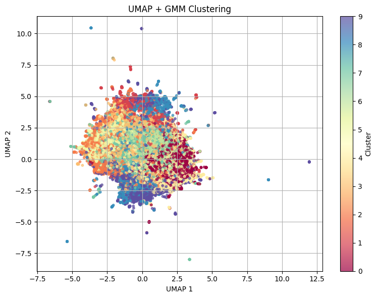
```python
from sklearn.mixture import GaussianMixture
from sklearn.decomposition import PCA
from sklearn.preprocessing import StandardScaler
import matplotlib.pyplot as plt
import seaborn as sns
import pandas as pd
import numpy as np
import umap
import scipy.stats as stats

# ✅ 데이터 로드
df = pd.read_pickle("/content/drive/MyDrive/SLink_PJT/Data/user_mfcc_features_gender_from_h5.pkl")
feature_cols = [f"mfcc_mean_{i+1}" for i in range(14)] + [f"mfcc_std_{i+1}" for i in range(14)]
X = df[feature_cols].values
X_scaled = StandardScaler().fit_transform(X)

# ✅ GMM 클러스터링
n_clusters = 10
gmm = GaussianMixture(n_components=n_clusters, covariance_type='full', random_state=42)
gmm_labels = gmm.fit_predict(X_scaled)

df['gmm_cluster'] = gmm_labels

# ✅ UMAP 2D 임베딩
X_umap = umap.UMAP(n_components=2, random_state=42).fit_transform(X_scaled)
df['umap_1'] = X_umap[:, 0]
df['umap_2'] = X_umap[:, 1]

# ✅ 저장
output_path = f"/content/drive/MyDrive/SLink_PJT/Data/noneprep_foreuser_mfcc_gmm_{n_clusters}_result.pkl"
df.to_pickle(output_path)
print(f"✅ GMM 결과 저장 완료: {output_path}")

# ✅ 시각화
plt.figure(figsize=(8, 6))
scatter = plt.scatter(df['umap_1'], df['umap_2'], c=df['gmm_cluster'], cmap='Spectral', s=10, alpha=0.7)
plt.colorbar(scatter, label='Cluster')
plt.title("UMAP + GMM Clustering")
plt.xlabel("UMAP 1")
plt.ylabel("UMAP 2")
plt.grid(True)
plt.tight_layout()
plt.show()

```
### 4.2.2 GMM 기반의 마할라노비스 거리(Mahalanobis distance) 를 이용해 이상치(outlier)를 정량적으로 탐지하고 제거
- 마할라노비스 거리 계산
  - 맥락을 정규화 시키고, 이를 활용해서 유클리드거리(d_E(x, y) = sqrt((x - y)^T * (x - y)))를 계산하는 방법
  - `d_M(x, μ) = sqrt((x - μ)^T * S^(-1) * (x - μ))`
- 평균 벡터와 공분산를 구하고, 이를 활용해서 마할라노비스 거리 계산
- 클러스터 별 상위 1%는 이상치로 판단하고 제거

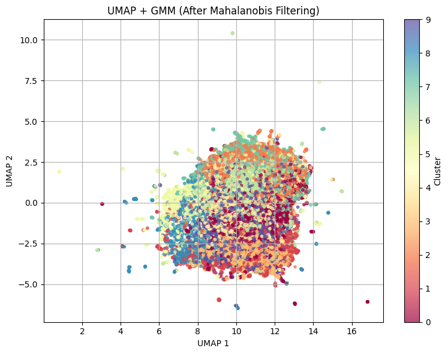
